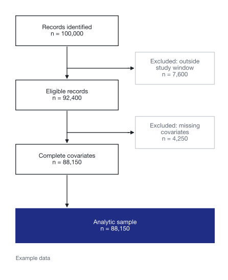
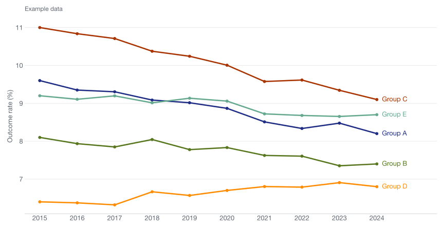

## Presentation title that names the study's topic {#cover .cover}

::: subtitle
A subtitle with the design or setting
:::

::: venue
Conference name · Month Year
:::

::: byline
**Presenter Name**, Coauthor One, Coauthor Two, Coauthor Three\
Department, Institution
:::

## Outline {#outline .agenda}

1. Background [Context and prior evidence]{.desc}
2. Data and methods [Data source, sample and design]{.desc}
3. Results [Main estimates and robustness]{.desc}
4. Discussion [Limitations and implications]{.desc}

<!-- A level-1 heading makes a numbered section slide -->
# Background

## An assertion-style title that states the slide's main point {#bullets}

- Lead with the claim in the title; use bullets for the evidence behind it
- Keep to three or four points per slide
  - Second-level points are smaller
  - Use them sparingly
- Put sources in an aside at the bottom of the slide

::: aside
Author A, Author B. Title of the source. *Journal*. 2024.
:::

## Research questions {#questions .statement}

1. First research question, phrased as a question?
2. Second research question, phrased as a question?
3. Third research question, phrased as a question?

::: note
### Contribution
One or two sentences on what this study adds relative to prior work.
:::

## Prior evidence leaves three open questions

::: {.cols .bottom}
::: col
### What we know
Two or three sentences summarizing the most relevant prior evidence.
:::

::: col
### The gap
What earlier studies could not answer, and why it matters.
:::

::: col
### This study
How this study addresses the gap: data, design and outcomes.
:::
:::

# Data and methods

## Study design {#design}

::: steps
::: col
### Data
Data source, years and unit of observation.
:::

::: col
### Sample
Inclusion and exclusion criteria.
:::

::: col
### Exposure
Treatment or exposure definition and timing.
:::

::: col
### Analysis
Estimator, comparison group and covariates.
:::
:::

## Five jurisdictions adopted the policy during the study period {#timeline}

<!-- Bars run from `from` to `end` (or `to`); res=2 allows half-year starts -->
::: {.gantt start=2016 end=2023 res=2}
[Jurisdiction A [January 2017]{.sub}]{from=2017}
[Jurisdiction B [January 2019]{.sub}]{from=2019}
[Jurisdiction C [July 2019]{.sub}]{from=2019.5}
[Jurisdiction D [January 2020]{.sub}]{from=2020}
[Jurisdiction E [January 2022]{.sub}]{from=2022}
:::

::: aside
Example timeline. The fifth bar takes the first extended palette color.
:::

## Analytic sample {#flow .figure-right}

Text on the left explains the figure on the right.

A short second paragraph can note subgroup or outcome-specific samples.

::: figure-panel

:::

# Results

## Outcome trends by group, 2015–2024 {#figure}

<!-- A lone image stretches to fill the space under the title -->

## Main estimates {#table}

| Outcome    | Baseline mean | Estimate (95% CI)        |      N |
|:-----------|--------------:|:-------------------------|-------:|
| Outcome A  |          0.00 | 0.00 (0.00, 0.00)        | 00,000 |
| Outcome B  |          0.00 | [0.00 (0.00, 0.00)]{.hl} | 00,000 |
| Outcome C  |          0.00 | 0.00 (0.00, 0.00)        | 00,000 |
| Outcome D  |          0.00 | 0.00 (0.00, 0.00)        | 00,000 |
| Outcome E  |          0.00 | 0.00 (0.00, 0.00)        | 00,000 |

: Table caption: model, comparison group and adjustment set.

::: aside
Highlight a cell with `[value]{.hl}`. Right-align numeric columns with `---:`.
:::

## The study in numbers {#stats}

::: stats
::: col
[5]{.num}
[Jurisdictions adopting the policy]{.label}
:::

::: col
[10]{.num}
[Years of data]{.label}
:::

::: col
[1.2M]{.num}
[Observations in the analytic sample]{.label}
:::
:::

## Categorical palette {#palette}

Steps, columns, key numbers, outline rows and timeline bars take colors in this order. Categories 1–4 are the theme colors; 5 and up come from Sanzo Wada's combinations that include them.

::: stats
::: col
[1]{.num}
[Theme]{.label}
:::

::: col
[2]{.num}
[Theme]{.label}
:::

::: col
[3]{.num}
[Theme]{.label}
:::

::: col
[4]{.num}
[Theme]{.label}
:::

::: col
[5]{.num}
[Wada]{.label}
:::

::: col
[6]{.num}
[Wada]{.label}
:::

::: col
[7]{.num}
[Wada]{.label}
:::

::: col
[8]{.num}
[Wada]{.label}
:::
:::

::: aside
Regenerate categories 5+ with `python3 _extensions/wada-primary/wada_palette.py`. The same colors are written to `_extensions/wada-primary/palette.csv` for figures.
:::

## Key finding 1 {#finding .takeaway}

One plain-language sentence stating the main result, with its magnitude.

One supporting line: the estimate and its confidence interval.

## Results are robust to alternative specifications {#callout}

:::: columns
::: {.column width="56%"}
- Alternative comparison group
- Event-study pre-trends
- Alternative outcome definitions
:::

::: {.column width="44%"}
::: {.callout-note title="Interpretation"}
How to read the estimates, e.g. percentage-point changes relative to the baseline mean.
:::
:::
::::

# Discussion

## Limitations {#limitations data-transition="slide"}

<!-- data-transition sets this slide's transition; the deck default is none -->

::: cols
::: col
### Measurement
How outcome or exposure measurement could bias the estimates.
:::

::: col
### Design
Threats to identification and how the analysis addresses them.
:::
:::

::: notes
Speaker notes go here; press S to open the speaker view.
:::

## Implications for policy, research and practice

::: {.cols .bottom}
::: col
### Policy
What decision makers should take from the results.
:::

::: col
### Research
The next questions this study raises.
:::

::: col
### Practice
What practitioners or data producers could do differently.
:::
:::

## References

<!-- With a bibliography: in the YAML, use `bibliography: refs.bib`, and put ::: {#refs} ::: here -->
::: references
Author A, Author B. Title of the article. *Journal*. 2024;00(0):000–000.

Author C, Author D, Author E, Author F, Author G, Author H. A longer article title that runs onto a second line, to show the hanging indent used for each reference in the list. *Journal Name*. 2023;00(0):000–000.

Author F. Title of a report. Publisher; 2022.
:::

## Thank you {#closing .closing}

Questions and comments welcome.

::: byline
**Presenter Name** · email\@institution.edu\
Paper: DOI or preprint link
:::
